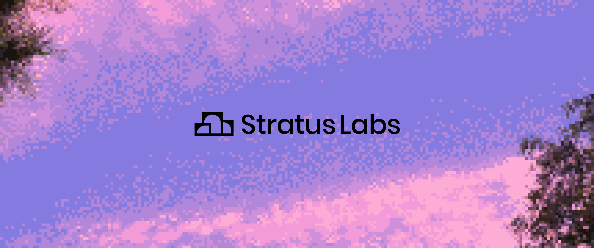

# Stratus Agent

**Always-on agents that get smarter over time.**

[](https://www.npmjs.com/package/@stratusagent/cli)
[](docs/start/installation.md)
[](LICENSE)

Stratus Agent runs a team of AI agents on your own machine and meets you
where you already are: the terminal, Slack, or a browser. Each agent is a
persistent identity — its own name, avatar, memory, tools, and Slack
presence — not a stateless chatbot. The runtime underneath is a tiny,
readable TypeScript kernel; everything optional is a plugin you add only
when you want it.

If a chatbot is a *session*, a Stratus agent is a *colleague*: it remembers
tomorrow what you told it today, in every channel it lives in.

## Quickstart

```bash
npm install -g @stratusagent/cli
stratus setup     # sign in, create your first agent, connect Slack — one menu
stratus chat      # talk; the conversation persists
```

No account yet? `stratus run "say hello"` works offline on the built-in
demo provider. Needs Node 22.13+ — details in
[Installation](docs/start/installation.md).

## What your agents can do

| | Capability | |
| --- | --- | --- |
| 🕐 | **Always on** — the whole roster as a daemon that survives reboots, with durable sessions | [Always on](docs/guides/always-on.md) |
| 💬 | **Live in Slack** — each agent its own app: avatar, presence, DMs, resumable threads, streaming replies | [Slack](docs/guides/slack.md) |
| 🧠 | **Remember** — memory keyed to the agent, searched and pruned by the agent itself | [Memory](docs/concepts/memory.md) |
| 🛠 | **Use real tools** — files, a shell, the web, a browser; each an opt-in plugin, allowlisted per agent | [Tools](docs/guides/tools.md) |
| 🔌 | **Mount MCP servers** — the whole MCP ecosystem under Stratus policy | [MCP](docs/guides/mcp.md) |
| 🛡 | **Ask before acting** — safe calls run unattended; risky ones ask a human, in Slack if that's where you are | [Approvals](docs/guides/approvals.md) |
| ⏰ | **Act on their own** — schedules an agent sets for itself, approved once by a human, reporting into Slack | [Schedules](docs/guides/schedules.md) |
| 📚 | **Learn procedures** — skills installed from any GitHub repo, loaded only when relevant | [Skills](docs/guides/skills.md) |
| 🤝 | **Work as a team** — delegation between agents, routing that keeps the same face in the same places | [Agents](docs/concepts/agents.md) |
| 🖥 | **Managed from anywhere** — one authenticated API, a web dashboard on top | [Remote access](docs/guides/remote-access.md) |

Providers: Claude via the official Anthropic SDK, Claude subscription
(Pro/Max) via the Claude Agent SDK, or any OpenAI-compatible API — with a
fallback model that catches mid-run errors, even across providers.

## Agents are people

An agent's whole identity lives in a **soul file** — frontmatter for the
structured parts, prose for the personality:

```markdown
---
name: Ava
provider: anthropic
model: claude-opus-5
tools: [fs.read, fs.search, web.fetch, memory.*]
skills: [code-review]
---

You are a sharp, warm generalist assistant. Answer first, explain second...
```

```bash
stratus agent new
# Say hello to Freya.
#   id      freya-k3x9
#   avatar  stratus theme, hue 211, palette #3d7dd9 #8fb8ea #d9993d
```

Don't name them and Stratus will; every agent gets a deterministic avatar
palette from their name, so the team looks cohesive on every surface. What
they learn in one thread they know in every other — memory belongs to the
agent, never to a session. More in [Agents](docs/concepts/agents.md).

## How it fits together

One package, `@stratusagent/cli`, carries the runtime: the kernel, the
providers, the roster, and `stratusd` — the always-on gateway. Everything
else is an optional plugin, and **installing a plugin does not run it**:
capability is enabled in a config you chose and then allowlisted per agent,
two gates apart. Channels (Slack), tools (fs, shell, web, browser), the MCP
bridge, and the control API + dashboard each arrive as separate packages —
`stratus setup` offers the ones your answers imply.

The trust model behind that is in
[Plugins](docs/concepts/plugins.md) and
[Security](docs/concepts/security.md); the design itself in
[`docs/architecture/`](docs/architecture/stratus-v2.md).

## What Stratus is not (yet)

Early, and honest about it: the core loop, the gateway, Slack, permissions,
tools, skills, schedules, MCP, and the dashboard are real today. Not yet a
production multi-tenant platform — remote executors, retries/queues, the
macOS app, deployment profiles, and per-agent isolation are
[on the roadmap](docs/roadmap/README.md), in that spirit of small kernel,
capability as plugins.

## Documentation

| I want to… | Read |
| --- | --- |
| Install and set up | [Installation](docs/start/installation.md) · [Setup](docs/start/setup.md) |
| Run something right now | [Quickstart](docs/start/quickstart.md) |
| Put my agents in Slack | [Slack](docs/guides/slack.md) |
| Give agents real capability, safely | [Tools](docs/guides/tools.md) · [Shell commands](docs/guides/shell.md) · [Approvals](docs/guides/approvals.md) |
| Let agents act on a schedule | [Schedules](docs/guides/schedules.md) |
| Run it as a service, read its logs, upgrade it | [Always on](docs/guides/always-on.md) · [Logs](docs/guides/logs.md) · [Updating](docs/guides/updating.md) |
| Fix a surprise | [Troubleshooting](docs/guides/troubleshooting.md) |
| Look up any command, flag, or config key | [CLI reference](docs/reference/cli.md) · [Configuration](docs/reference/config.md) |
| Understand the ideas | [Agents](docs/concepts/agents.md) · [Memory](docs/concepts/memory.md) · [Plugins](docs/concepts/plugins.md) · [Security](docs/concepts/security.md) |
| Build against it | [Control API](packages/control-api/README.md) · [Architecture](docs/architecture/stratus-v2.md) · [Roadmap](docs/roadmap/README.md) |

The full index lives at [`docs/`](docs/README.md).

## From source

```bash
corepack enable && corepack prepare pnpm@10.18.3 --activate
git clone https://github.com/stratuslabs/agent.git && cd agent
pnpm install --frozen-lockfile
pnpm build && pnpm typecheck && pnpm test    # what CI runs
node packages/cli/dist/bin.js setup          # the CLI from the checkout
```

Conventions worth reading before a PR are in [`CLAUDE.md`](CLAUDE.md);
the packages are laid out flat under [`packages/`](packages), one plugin or
kernel piece each.

## License

[MIT](LICENSE)
